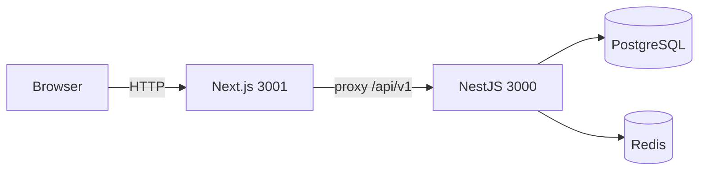

# DL System

**DL System** is the foundation for a future **ERP-style** product. Today the monorepo ships a NestJS API and a Next.js app with **authentication** (JWT access token + **httpOnly** refresh cookie), **users**, **tickets** (with concurrency control), **clients**, and **client contracts**. The backend uses **BullMQ** for asynchronous notifications (so HTTP responses are not blocked), **Redis** for caching and rate limiting, and a **ports-and-adapters** architecture (domain and use cases decoupled from infrastructure).

This repository is a **monorepo** with a separate NestJS API and Next.js app; each folder has its own `package.json`.

## Repository layout

| Folder | Description |
|--------|-------------|
| [backend/](backend/) | NestJS API, Prisma, PostgreSQL, Redis, BullMQ, Zod validation. More detail: [backend/README.md](backend/README.md). |
| [frontend/](frontend/) | Next.js (App Router), TanStack Query, Zod-powered forms, shadcn/ui, OpenAPI-typed client. More detail: [frontend/README.md](frontend/README.md). |

## Prerequisites

- **Node.js** matching the backend engines: `^20.19.0 || ^22.12.0 || >=24.0.0` (see [backend/package.json](backend/package.json)); the frontend targets Node 20+.
- **npm**
- **Docker** and Docker Compose (recommended for local PostgreSQL and Redis)
- **[k6](https://k6.io/)** (optional) — load tests described in the backend README

## Quick start

### 1. Infrastructure (Postgres + Redis)

[backend/docker-compose.yml](backend/docker-compose.yml) starts Redis (port **6379**, with `REDIS_PASSWORD`) and PostgreSQL 14. The Nest API service is commented out; in development you typically run Nest on the host.

In the backend folder, create a `.env` from the example and align variables with Compose (database user/password, Redis, etc.):

```bash
cd backend
cp .env.example .env
# Edit .env: DATABASE_URL, JWT_SECRET, REDIS_*, POSTGRES_* to match docker-compose
docker compose up -d
```

Minimum backend variables are documented in [backend/README.md](backend/README.md) (`DATABASE_URL`, `JWT_SECRET`, Redis, and others).

### 2. Backend

```bash
cd backend
npm install
npx prisma migrate dev
npm run prisma:seed
npm run start:dev
```

After migrations, run **`npm run prisma:seed`** (or `npx prisma db seed`) so **geography** exists (`countries`, `states`, `cities`). Without it, authenticated calls such as `GET /api/v1/states?countryUuid=…` can fail and the client address form cannot load states. The bundled seed uses **fixed UUIDs for local development only**; replace or extend this with your own data load when you move to production data.

The API defaults to **http://localhost:3000** with the **`/api/v1`** prefix. Examples:

- `POST /api/v1/auth/login`
- `GET /api/v1/tickets` with `Authorization: Bearer …`
- `GET /api/v1/clients` and `GET /api/v1/client-contracts` (also require a Bearer token)

Interactive OpenAPI docs at `/docs`: enabled when `ENABLE_OPENAPI_DOCS=true`, or by default in local `development` (see [backend/README.md](backend/README.md)).

### 3. Frontend

In a second terminal:

```bash
cd frontend
cp .env.example .env.local
npm install
npm run dev
```

The app runs on **http://localhost:3001** so it does not clash with Nest on 3000. After sign-in, the default route is **`/dashboard`** (clientes, contratos, pesquisa e métricas). **Clientes:** `/dashboard/clients`, `/dashboard/clients/[id]`. **Chamados:** `/dashboard/tickets`, `/dashboard/tickets/new`, `/dashboard/tickets/[id]/edit`.

- **`BACKEND_INTERNAL_URL`** — target for rewrites in `next.config.ts` (`/api/v1/*` → Nest), avoids browser CORS issues.
- **`NEXT_PUBLIC_API_BASE_PATH`** — should be `/api/v1` to match the proxy.

## Request flow (development)



## Further reading

- **Authentication, HTTP routes, UUIDs, rate limits** — [backend/README.md](backend/README.md) (*Authentication*, *Rotas HTTP*, *Identifiers*, *Getting started*).
- **Error responses** (envelope JSON, optional stable **`code`**, módulo `application/errors/`) — [backend/README.md](backend/README.md) (*API errors*).
- **OpenAPI / generated types** (`openapi:pull`, `openapi:generate`) — [frontend/README.md](frontend/README.md).
- **Load testing (k6)** — [backend/README.md](backend/README.md) (*Load testing*).

## License

**Private** project, `UNLICENSED` (see [backend/package.json](backend/package.json)).
