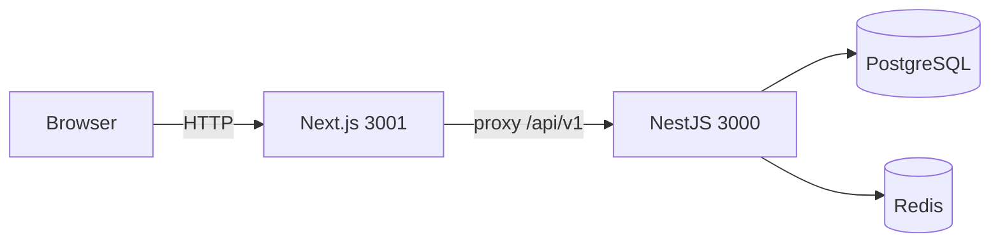

# DL Tickets

Sistema de **tickets** com autenticação (JWT de acesso + refresh em cookie **httpOnly**), utilizadores e operações sobre tickets com controlo de concorrência. O backend usa **filas (BullMQ)** para notificações assíncronas (evita bloquear a resposta HTTP), **Redis** para cache e rate limiting, e uma arquitetura **ports-and-adapters** (domínio e casos de uso desacoplados da infraestrutura).

Este repositório é um **monorepo** com API NestJS e aplicação Next.js separadas; cada pasta tem o seu próprio `package.json`.

## Estrutura

| Pasta | Descrição |
|-------|-----------|
| [backend/](backend/) | API NestJS, Prisma, PostgreSQL, Redis, BullMQ, validação Zod. Documentação detalhada: [backend/README.md](backend/README.md). |
| [frontend/](frontend/) | Next.js (App Router), TanStack Query, formulários com Zod, shadcn/ui, cliente tipado via OpenAPI. Documentação detalhada: [frontend/README.md](frontend/README.md). |

## Pré-requisitos

- **Node.js** compatível com o backend: `^20.19.0 || ^22.12.0 || >=24.0.0` (ver [backend/package.json](backend/package.json)); o frontend segue com Node 20+.
- **npm**
- **Docker** e Docker Compose (recomendado para PostgreSQL e Redis locais)
- **[k6](https://k6.io/)** (opcional) — testes de carga descritos no README do backend

## Início rápido

### 1. Infraestrutura (Postgres + Redis)

O ficheiro [backend/docker-compose.yml](backend/docker-compose.yml) sobe Redis (porta **6379**, com `REDIS_PASSWORD`) e PostgreSQL 14. O serviço da API Nest está comentado; em desenvolvimento costuma-se correr o Nest na máquina.

Na pasta do backend, crie um ficheiro `.env` a partir do exemplo e alinhe as variáveis ao Compose (utilizador/palavra-passe da base, Redis, etc.):

```bash
cd backend
cp .env.example .env
# Edite .env: DATABASE_URL, JWT_SECRET, REDIS_*, POSTGRES_* conforme docker-compose
docker compose up -d
```

Variáveis mínimas do backend estão documentadas em [backend/README.md](backend/README.md) (`DATABASE_URL`, `JWT_SECRET`, Redis, entre outras).

### 2. Backend

```bash
cd backend
npm install
npx prisma migrate dev
npm run start:dev
```

A API fica por defeito em **http://localhost:3000**, com prefixo **`/api/v1`** (ex.: `POST /api/v1/auth/login`, `GET /api/v1/tickets` com `Authorization: Bearer …`).

Documentação interativa OpenAPI (quando ativada): `/docs`.

### 3. Frontend

Num segundo terminal:

```bash
cd frontend
cp .env.example .env.local
npm install
npm run dev
```

A app corre em **http://localhost:3001** para não colidir com o Nest na 3000. Fluxos principais: `/tickets`, `/tickets/new`, `/tickets/[id]/edit`.

- **`BACKEND_INTERNAL_URL`** — destino dos rewrites em `next.config.ts` (`/api/v1/*` → Nest), evita CORS no browser.
- **`NEXT_PUBLIC_API_BASE_PATH`** — deve ser `/api/v1` para coincidir com o proxy.

## Fluxo de pedidos (desenvolvimento)



## Documentação adicional

- **Autenticação, tickets, UUIDs e rate limits** — [backend/README.md](backend/README.md) (secções *Authentication*, *Identifiers*, *Getting started*).
- **OpenAPI / tipos gerados** (`openapi:pull`, `openapi:generate`) — [frontend/README.md](frontend/README.md).
- **Testes de carga (k6)** — [backend/README.md](backend/README.md) (secção *Load testing*).

## Licença

Projeto **privado**, `UNLICENSED` (ver [backend/package.json](backend/package.json)).
